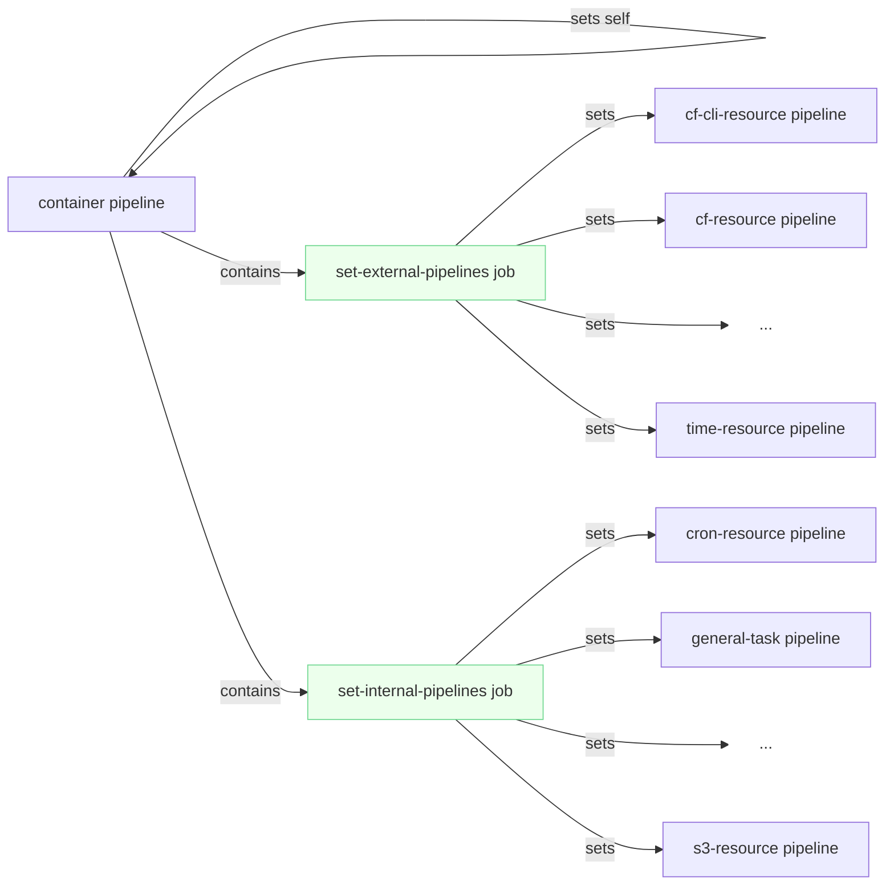

# Common Concourse Pipelines

Reusable Concourse pipelines. Reference the pipeline for your app's language, `fly set-pipeline`, and you're done.

## Index

* `ci`: Concrete pipeline instances that use templates from this repository.
* `container`: Template pipelines for containerized software.
* `go`: Template pipeline for Go apps. Not currently in use.

## Usage

See each pipeline folder for pipeline-specific details. The general instructions follow.

Set the `src-repo` value in your repository's Credhub path:

```sh
credhub set -n /path/to/repo/src-repo -v cloud-gov/your-repo
```

Run `credhub find -n src-repo` for examples.

Create file `ci/pipeline.yml` in your repository (or this one!) with the following contents, replacing LANGUAGE with your app's language:

```yaml
jobs:
- name: set-self
  plan:
    - get: common-pipelines
      trigger: true
    - set_pipeline: self
      file: common-pipelines/LANGUAGE/pipeline.yml

resources:
- name: common-pipelines
  type: git
  source:
    uri: https://github.com/cloud-gov/common-pipelines
    branch: main
    commit_verification_keys: ((cloud-gov-pgp-keys))
```

Commit and push the bootstrap pipeline for future use, and bootstrap the pipeline in Concourse:

```sh
fly -t ci set-pipeline --pipeline your-pipeline-name --config ci/pipeline.yml
```

Navigate to Concourse and un-pause the pipeline. The `bootstrap` job will run and replace itself with the common pipeline you specified. If the common pipeline is updated in the future, your pipeline will automatically pull in the changes.

## Motivation

An adage of Continuous Integration: "Treat pipelines like cattle, not like pets."

cloud.gov maintains a variety of software written in a handful of programming languages. Apps written in the same language should be built and deployed in the same way, and developers should not have to reinvent the wheel by writing a new pipeline every time.

## Architecture

Common pipelines use a parent/child pattern so that one pipeline can manage many others. For example, this diagram shows the relationships between container pipelines:



This has several advantages over individually set pipelines:

* Operators only need to manually fly one pipeline, for example `container`, instead of many individual pipelines, making recovery in case of system error easier.
* The single top-level pipeline can use Concourse steps like `across` to set each child pipeline in the exact same way, with any differences extracted as `vars`. This brings all the benefits of DRY to pipelines.

## Design principles

* Developers should be able to adopt common pipelines into their pipeline with a minimum of effort. Zero or one lines of code would be ideal.
* The configuration options for each pipeline should be minimal. They're the API of the pipelines; keep it simple.
* Favor convention over configuration. Repositories using common pipelines should "just work" if their folders and files are in the right place.

## Development

If you want to iterate on a pipeline in this repository, consider pushing your changes to a topic branch. Topic branches do not have merge protection, so you will be able to iterate more quickly without getting pull requests approved. Change your `pipeline.yml` in your downstream repository to reference your topic branch instead of `main` in the `common-pipelines` resource to continuously pull in your changes. (You can consider working on a topic branch in your downstream repo as well.)

## Troubleshooting

### Pipeline archived after bootstrap

If your pipeline shows up as "Archived" in Concourse after running the steps in [Usage](#Usage), the cause could be one of the following:

* A branch is wrong, either in `common-pipelines` (if you are using a topic branch to work on a pipeline; see [Development](#Development)) or in your own repository's `ci/pipeline.yml`. Each file has a resource representing `common-pipelines` and representing your repository, making **four total resources**; Double-check that they all match and set the pipeline again. (You may need to run `fly destroy-pipeline` to remove the archived pipeline.)
* An input name may be wrong. Check the logs of the `set_self` step for errors.

### Old pipeline version

After bootstrapping, Concourse will sometimes update a pipeline using outdated (possibly cached) resources. Destroy the pipeline, wait a moment, and try again.
